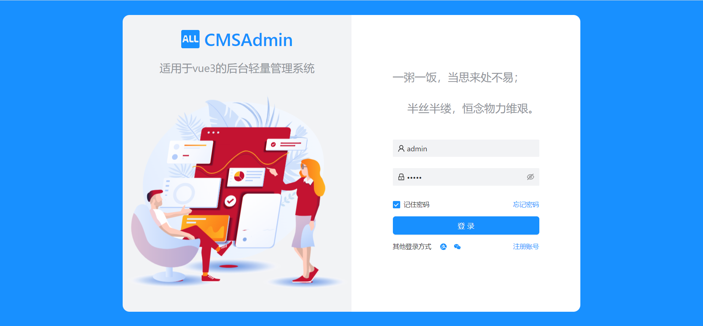

# cmsAdmin(Collection management system)

#### 介绍
适用于vue3的后台轻量管理系统

#### 软件架构
vite vue3 ant-design-vue pinia

#### 安装教程

安装依赖  pnpm install

#### 使用说明

1.  http下为mock假数据，修改账号可实现静态登录。后期更换为正式接口即可
2.  router下guard为路由守卫文件
3.  settings为全局设置，包含主题和界面布局设置

#### 界面展示

